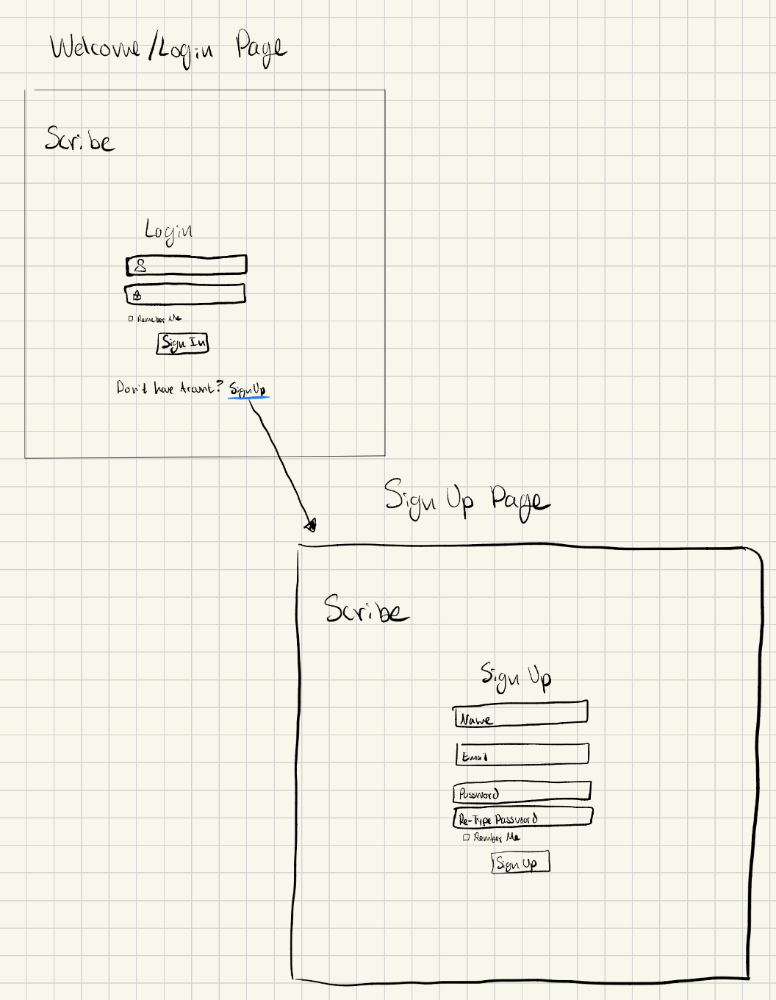
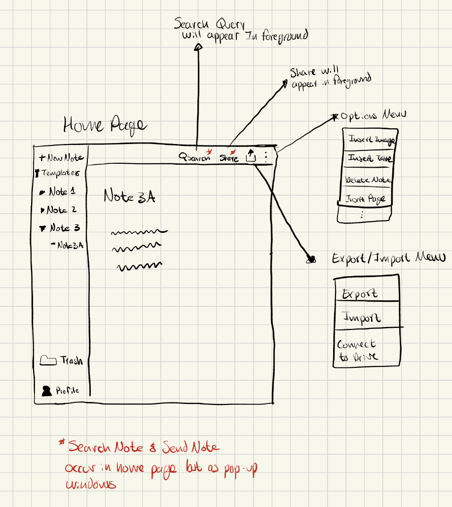

## Functional Requirements
1. Create Note: User is able to create a note
2. Edit Note: User is able to edit a note that has been created
3. Create Pages: User is able to create pages to organize notes
4. Create Template: User can create a template that acts as a boilerplate when creating notes
5. Delete Note: When user chooses to delete a note, it will be stored in a trash folder and there they can permanently delete afterwards
6. Share Note: User is able to share their notes to other users
7. Export & Import w/ Google Drive API: User can connect to their Google Drive to export and import to an from their Drive
8. Recover Note: User is able to recover deleted notes
9. Search Note: User is able to search a note by its text contents
10. Create User Profile: User can create a profile from which they can log into 
11. Edit User Profiles: User can edit their profile
12. Insert Images: Add ability to attach images to notes
13. Spell Check: User is given suggestions when they have improper grammar/spelling using python library Spello

## Non-functional Requirements
1. Application will run on Chrome Chrome
2. The application is responsive and changes size depending on window size

## Use Cases
1. Create Note - Fardin Haque\
\
- **Pre-condition:** The user is on the main page
- **Trigger:** User clicks on the create note button
- **Primary Sequence:**
    1. The system prompts the user to enter which template they would like to choose (initally set to "blank" template), select a page to nest this note, name the note, and give it an optional description. (System assigns timestamp with this note visible as a text field to user)
    2. The user clicks the template and page options from a drop-down menu. 
    3. The system shows the user the list of saved templates and pages.
    4. User selects a template and page and enters name and description.
    5. The user clicks "Create Note"
    6. The system checks if the note name is unique
    7. The systems saves the note information 
    9. System displays note in navigation bar and opens the edit note page (See Use Case #2)
- **Primary Postconditions:** The user can access their created notes in expandable lists within the navigation folder
- **Alternate Sequence:** User tries to create a note with a name that is already taken by another note
    1. System displays warning that this name is already taken
    2. User changes name to something that is unique
    3. System removes warning that name is taken
- **Alternate Sequence #2:** User tries to click "Create Note" without filling out the name field
    1. System displays warning that a name has to input
    2. User inputs a name that has not been taken yet
    3. System removes warning invalid name warning

2. Edit Note - Fardin Haque\
\
- **Pre-condition:** The note they want to edit exists and is in the navigation bar
- **Trigger:** User clicks on a note in the navigation bar or creates a note
- **Primary Sequence:** 
    1. The system displays the note in a text area, presents style options like highlight, italics, bold, etc., and shows additionally buttons like insert images (See Use Case #12)
    2. User adds or deletes text from the note
    3. User selects text and clicks style option (highlight, italics, bold, etc.)
    4. System displays changes 
    5. User clicks "Save Changes"
    6. System saves the changes made to the note
    7. User clicks "Go Home"
    8. System opens the home page
- **Primary Postconditions:** The system saves the note with its changes
    - The user will be able to see their new changes upon revisiting the note
    - The system does not save the version before their changes
- **Alternate Sequence:** User makes changes to the note and clicks "Go Home" instead of "Save Changes"
    1. Systems displays warning message that changes have not been saved 
    2. User clicks "Cancel" and returns to note page
    3. User clicks "Save Changes" and then "Go Home"
    4. System saves updated note

3. Create Pages - Fardin Haque\
\
- **Pre-condition:** User is on the main page
- **Trigger:** User clicks on the "Create Page" button
- **Primary Sequence:**
    1. System prompts user for this page's name and give an optional description. (System assigns timestamp for this page and is visible to user as a text field)
    2. User enters and description clicks "Create Page"
    3. The system saves the page information
    4. The system displays the page in the navigation bar and changes the screen to view the page details 
- **Primary Postconditions:** The user is able to view their page in the navigation bar and is available in the list of page when creating a note.
- **Alternate Sequence:** User tries to create a page without giving it a name or uses a non-unique name
    1. The system will display an invalid name erorr
    2. The system will prompt the user to input a valid name to continue
    2. The user will change input a anme or change the name to something unique
- **Alternate Sequence #2:** The user enters fields for page and clicks "Go Home"
    1. The system warns the user that their changes will not be saved
    2. The system allows the user to "Continue" or "Cancel"
    2. The user clicks "Cancel" and they return to the create page display

4. Create Template - Fardin Haque\
\
- **Pre-condition:** The user is on the main page
- **Trigger:** The user clicks on the "Create Template" button
- **Primary Sequence:**
    1. The system prompts the user to enter information on this template's name and a generated time-stamp is visible as a text-field to the user
    2. The user inputs the name of the template
    3. The system scrolls down to a text-area that allows them to create boiler-plate for this template with all the same options as edit note (See Use Case #2)
    4. The user inputs text, styles, tables, images, etc. that they would like like to populate this template with
    5. User clicks on "Save Template"
    6. System checks if name is valid and saves template
    - **Primary Postconditions:** The template is available in the list of templates when creating a note now (See Use Case #1 for context)
- **Alternate Sequence:** The user assigns a non-uniqe or null name to the template
    1. The system displays an error that the template name is invalid
    2. The system prompts the user to change the name of the template
- **Alternate Sequence:** The user makes changes to template and clicks "Go Home"
    1. The system will warn the user that their template will not be saved
    2. The system presents "Cancel" and "Continue" options
    3. The user hits cancel and returns to the create template page

5. Delete Note - Carlos Quiroz\

- **Pre-Condition:** User must have a note created
- **Trigger:** User clicks on delete button
- **Primary Sequence:**
    1. User selects note options menu
    2. System will display menu that includes a delete option
    3. User selects delete option
    4. System will display a confirmation message with two options to the user, cancel or delete
    5. User selects option to delete
    6. System stores the deleted note in a trash folder
    7. System displays all deleted notes inside of trash folder
    8. User has options to do a permanent deletion of note, recover the note or leave as is and system will permanently delete note in 30 days
- **Primary Postconditions:** The note user selected to be deleted is in trash folder
    - Deleted note is removed from users current notes
- **Alternate Sequence:** User tried to delete note but fails due to storage limit
    1. System will display an error message
    2. User can free space by cleaning trash folder
    3. System allows user to delete note again
- **Alternate Sequence #2:** User selects to permanently delete note
    1. User selects note to delete
    2. System displays confirmation message
    3. User selects to delete note  
    4. Note is permanently deleted from users account
    5. System displays message that note is deleted permanently

6. Share Note - Carlos Quiroz\
\
- **Pre-Condition:** User is logged in and recipient has an account
- **Trigger:** User clicks on share button
- **Primary Sequence:**
    1. User selects note they want to share
    2. User clicks on share button
    3. System prompts user to enter email of recipient user
    4. User enters emails of intended recipient
    5. System will check if it is a valid email and valid user attached to email
    6. User clicks send
    7. Selected note are shared between owner(user) and recipient.
- **Primary Postconditions:** The shared note is available to all intended recipients
    - Recipient can view note
- **Alternate Sequence:** Email of recipient is not valid and or not a valid user
    1. System will display an error message stating invalid recipient credentials
    2. System prompts user to re enter email again
    3. User can click send once re entered email is verfied
- **Alternate Sequence #2:** User clicks on send button but note fails to send
    1. System prompts user to retry with a retry button
    2. System will re attempt to send note to recipient by re initiating the sending process
    3. System display success message once action is completed

7. Export & Import w/ Google Drive API - Carlos Quiroz\
\
- **Pre-Condition:** User has connected Google Drive with their account
- **Trigger:** User clicks on export/import button
- **Primary Sequence:**
    1. User clicks on export/import button 
    2. System prompts user to select import or export 
    3. User clicks on export
    4. System prompts user to choose a file format(pdf, txt, docx, etc)
    5. User chooses a format and clicks on export button
    6. System connect to Google Drive api
    7. User selects destination where note will go in their Google Drive
    8. User clicks upload button to google drive
    9. System displays message when export was successful
- **Primary Postconditions:** Selected note has been exported to Google Drive or Selected file in Google Drive has been imported into note
- **Alternate Sequence:** User clicks on import
    1. System connects to Google Drive api with user credentials
    2. User selects which file they want to import(restricted to supported files)
    3. File is now imported to users notes
- **Alternate Sequence #2:** System fails to connect to Google Drive
    1. System displays error message stating failed connection
    2. User can reload page to establish a connection

8. Recover Note - Carlos Quiroz
- **Pre-Condition:** User has deleted a note
- **Trigger:** User clicks on recover button
- **Primary Sequence:** 
    1. User is inside of the trash folder
    2. User clicks on recover button
    3. System prompts user to select the note they want to recover
    4. User selects note
    5. User clicks on checkmark button to confirm recovry of note
    6. System prompts user to confirm their choice (cancel or recover buttons) w/ a message
    7. User confirm by clicking on recover
    8. System moves note from trash folder back to where user had previously had stored the note
- **Primary Postconditions:** Selected note is recovered and available to user
    - User has access to note with their current notes
- **Alternate Sequence:** Previous location of note no longer exists
    1. System will move note to main Notes section
    2. User can then select to move the location of the note as they wish
- **Alternate Sequence #2:** Trash Folder is empty and user clicks on recover button
    1. System will display a message that folder is empty
    2. User can leave trash folder and the folder will remain the same

9. Search Note - Carlos Quiroz\
\
- **Pre-condition:** User must have an existing note
- **Trigger:** User clicks on search button
- **Primary Sequence:**
    1. User clicks on search button
    2. System display a search bar where user can type a text input of a phrase or keywords they seek
    3. User types a text input
    4. System will look through all notes seeking those that match users input
    5. System will display all note(s) that contains users input
    6. User can select the note that contain the text content they seek
- **Primary Postconditions:** User finds notes that contains the text contents they were seeking for
- **Alternate Sequence:** System can't find a match for user search input
    1. System displays an error message
    2. System prompts user to try and search for a different term
    3. System will continue once it finds a match to the given search input

10. Create User Profile - Henry To\

- **Pre-condition:** The user is on the main page
- **Trigger:** User clicks on create profile button
- **Primary Sequence:**
    1. User clicks on create profile button
    2. System displays a create profile button
    3. User types in string of text for name
    4. System will create the user profile
    5. System will display all the profiles created
    6. User can now select which profile to pick
- **Primary Postconditions:** User profile is now added 
- **Alternate Sequence:** The user does not choose to create a profile but instead picks a profile
    1. System prompts user to pick a profile
    2. A profile is selected
- **Alternate Sequence #2:** The user decides not to create a profile page
    1. User is prompted if they are sure if they want to cancel
    2. The request is canceled
    3. User is back on the main page

11. Edit User Profiles - Henry To
- **Pre-condition:** User must have an existing profile
- **Trigger:** User clicks on edit profile
- **Primary Sequence:**
    1. User clicks on edit profile
    2. System display options on how to edit profile
    3. Options to rename profile
    4. System prompts user on what the new name should be
    5. System updates the profile
- **Primary Postconditions:** User has added an images to their notes
- **Alternate Sequence:** The user decides to change profile picture
    1. User clicks on change profile picture
    2. System displays to upload the picture
    3. System updates the user profile picture
    4. System updates the profile
- **Alternate Sequence #2:** The user decides not to change their user profile
    1. System prompts user if they are sure to proceed with no changes
    2. The user is back to the main page
   
12. Insert Images - Henry To\
\
- **Pre-condition:** User must have an existing note
- **Trigger:** User clicks on add images to notes
- **Primary Sequence:**
    1. User clicks on add images to notes
    2. User is prompted to choose what type of images to post
    3. User clicks on images they would like to upload
    4. User submits the images to the existing note
    5. The database is now updated with the image on the notes
- **Primary Postconditions:** User has added an images to their notes
- **Alternate Sequence:** User tries to upload a video instead of an image
    1. User is prompted to specify that an image is required
    2. User is back to prompt on uploading an image

13. Insert Tables - Henry To
- **Pre-condition:** User must have existing notes
- **Trigger:** User clicks on create table within the notes  
- **Primary Sequence:**
    1. User clicks on create table option
    2. User is prompted as to what size the table needs to be
    3. User chooses the table type
    4. Table is created in the notes
    5. The table is prompted to require a link to notes
    6. The system checks if the table link is valid
    7. Tables is now created with links to notes
    8. The database is now updated with the table within the notes
- **Primary Postconditions:**  User has now added tables with a link to the notes attached
- **Alternate Sequence:** User Tables are created with no links to the notes
    1. User decides to attach no links to the notes
    2. User is prompted if they are sure they do not want link to the notes
    3. User notes is created without a link

14. Spell Check - Fardin Haque
- **Pre-condition:** User is in a note they created
- **Trigger:** User creates a mistake in their grammar/spelling
- **Primary Sequence:** 
    1. User is writing in their note and they make a mistake
    2. System will use the library Spello running in the background to provide any suggestions
    3. System will underline spelling with a red line to indicate their a suggestion
    4. User can click on the suggestion and accept it and it will update their note
- **Primary Postconditions:** The note is updated with the correct spelling/grammar upon user confirmation
- **Alternate Sequence:** User declines spelling suggestion
    1. User can ignore spelling suggestion and the system will remove the red underline from it